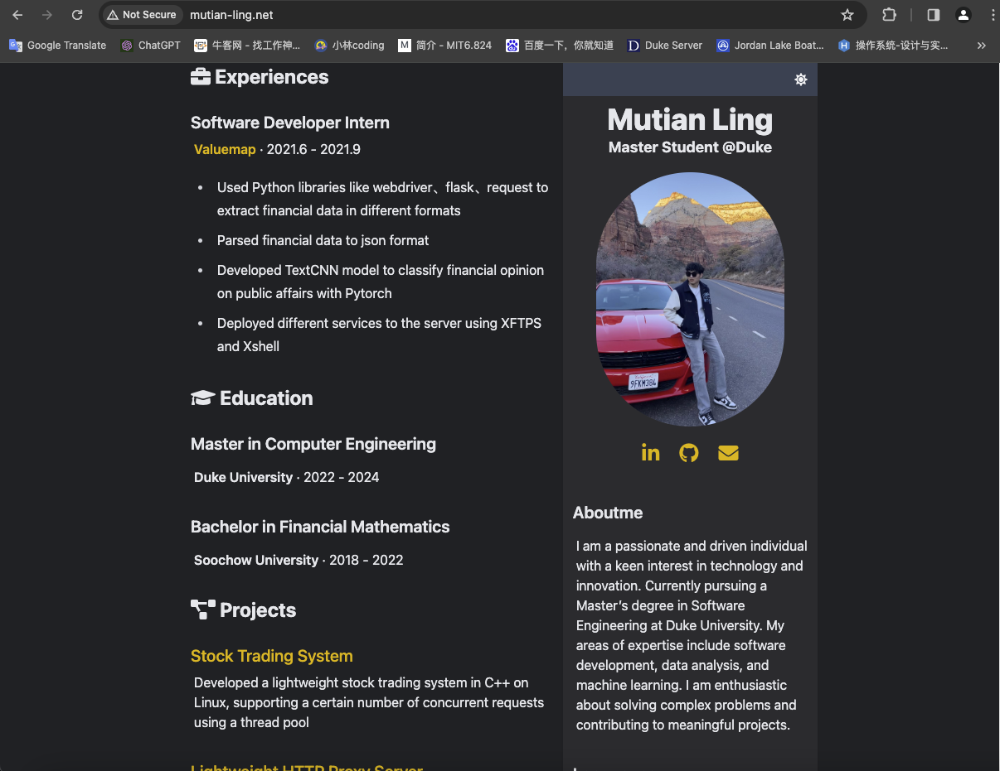

# Personal Website

My website is deployed on AWS S3.

[Check my web here](http://mutian-ling.net)

## Live demo

[Click here](#) for live demo.

## Features

### 9 modules

### CICD

when I make some changes to the website and push to my git repo, a git pipeline will run and my website will be updated after a few minutes. Check it here:

